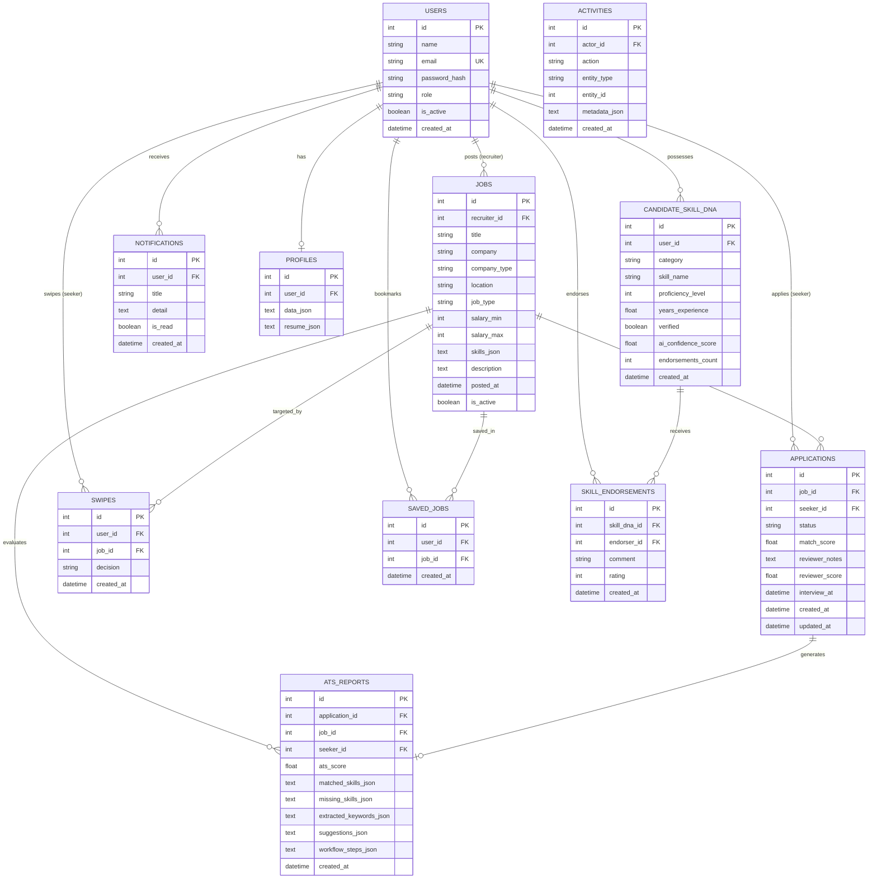

# Database Schema & Entity Relationship Model

This document outlines the database schema for the **Job Discovery Platform (SwipeX)**, including relational models, field data types, foreign keys, and the **Candidate Skill DNA & Verification Matrix**.

---

## 📊 Entity Relationship Diagram (ERD)

---

## 🧬 Unique Feature: Candidate Skill DNA Matrix

The **Candidate Skill DNA** subsystem represents a multidimensional skill proficiency and endorsement graph:

### 1. `candidate_skill_dna` Table
| Column | Type | Description |
|---|---|---|
| `id` | `INTEGER` (PK) | Primary identifier |
| `user_id` | `INTEGER` (FK) | Reference to `users.id` |
| `category` | `VARCHAR(50)` | Category: `Technical`, `Domain`, `Soft`, `Tooling` |
| `skill_name` | `VARCHAR(100)` | Normalized skill name (e.g. `React`, `FastAPI`, `System Design`) |
| `proficiency_level` | `INTEGER` (1-5) | 1 = Beginner, 3 = Intermediate, 5 = Expert |
| `years_experience` | `FLOAT` | Hands-on years with this capability |
| `verified` | `BOOLEAN` | Verified through assessments, endorsements, or work experience |
| `ai_confidence_score` | `FLOAT` | Dynamic AI parsing confidence (0.00 to 1.00) |
| `endorsements_count` | `INTEGER` | Number of verified peer/recruiter endorsements |
| `created_at` | `DATETIME` | Timestamp of skill entry |

### 2. `skill_endorsements` Table
| Column | Type | Description |
|---|---|---|
| `id` | `INTEGER` (PK) | Primary identifier |
| `skill_dna_id` | `INTEGER` (FK) | Reference to `candidate_skill_dna.id` |
| `endorser_id` | `INTEGER` (FK) | Recruiter/peer user ID giving endorsement |
| `comment` | `TEXT` | Specific testimonial or recommendation |
| `rating` | `INTEGER` (1-5) | Endorsement rating score |
| `created_at` | `DATETIME` | Timestamp of endorsement |

---

## 🚀 Key APIs for Skill DNA

- `GET /api/skill-dna`: Retrieve logged-in candidate's Skill DNA and radar metrics.
- `GET /api/candidates/{candidate_id}/skill-dna`: Recruiter view of candidate's verified skill footprint.
- `POST /api/skill-dna`: Add or update a candidate skill attribute.
- `POST /api/skill-dna/{skill_id}/endorse`: Endorse a candidate skill.
